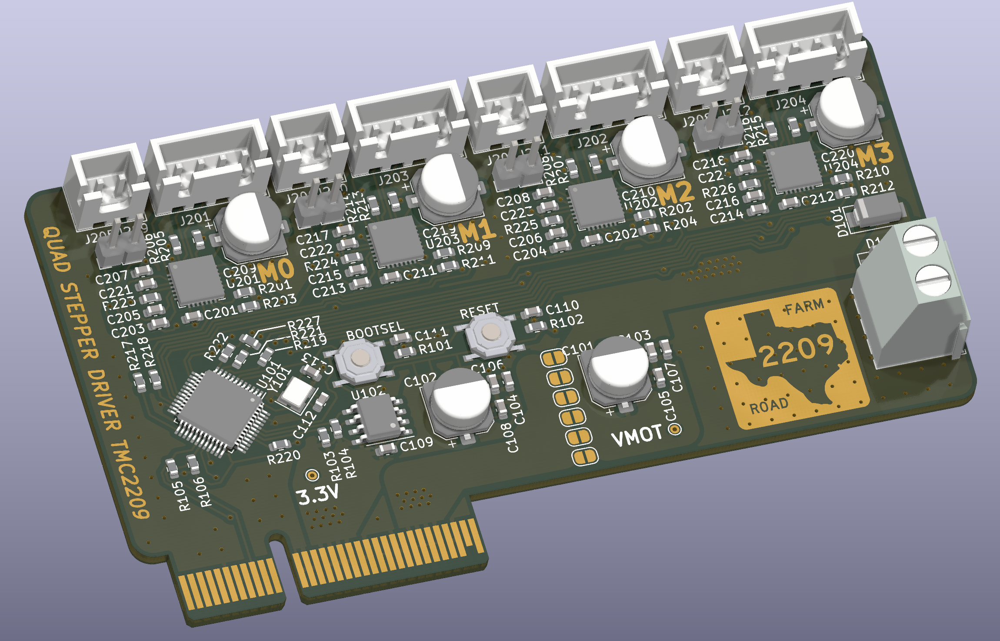

# quad-stepper-2209-expansioncard
Meant for use with the Klipper Backplane I designed, to support 4x stepper motors with TMC2209 drivers and endstops (configurable for both digital endstop triggered by driver) or physical endstops installed on the machine.
This is extendable, i.e. if you wanted support for another 4 motors, you can add one more of these cards to the system.

